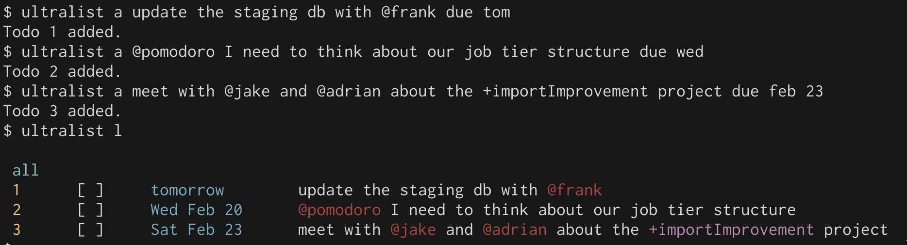

# Using the Ultralist CLI

## Creating a todolist {#create_todolist}

You can initialize a todolist by running `ultralist init`. This will create a `.todos.json` in the directory you are in.

**The todolist in your home directory is special.** `ultralist` will use the list in your home dir if it does not see a .todos.json in the directory you are in. This allows you to manage your main todolist file even if you are in another directory.

## Adding todos {#adding_todos}

Add a todo by running `ultralist add` or `ultralist a`, and then filling out the details of the todo.

A `+project` or `@context` can be inserted into the todo body. Currently they can only be one word long.

`ultralist` expects the due date at the _end_, if there is a due date.

##### Due date format

For things due today or tomorrow, you can use `due today` and `due tomorrow`. You can also use `due tod` or `due tom`.

For things due this week, you can use the first 3 letters of the day name. For instance, `due mon` or `due thu`. **`ultralist` will always look forward**.  If today is a Wednesday and you specify `due mon`, the due date will be for _next Monday_.

For specific dates, you can use either `due may 2` or `due 2 may`. The month is always lowercase and 3 letters.

##### Examples

## Completing/Uncompleting todos {#completinging_todos}

* `ultralist complete [id]` or `ultralist c [id]` - complete a todo
* `ultralist uncomplete [id]` or `ultralist uc [id]` - un-complete a todo

## Archiving/Unarchiving todos {#archiving_todos}

* `ultralist archive [id]` or `ultralist ar [id]` - archive a todo
* `ultralist unarchive [id]` or `ultralist uar [id]` - unarchive a todo

## Editing todos {#editing_todos}

You can edit a todo's subject or due date The syntax is as follows:

`ultralist e [id] <subject> <due [due]>`

##### Editing a todo's subject

When if you do not include `due [date]`, then just the subject will be edited.

Example: `ultralist e 3 chat with +bob` will edit just the todo's subject, and leave the due date alone.

##### Editing a todo's due date

If you only pass `due [date]`, the todo's due date will be updated, and the subject will remain the same.

Example: `ultralist e 3 due tom` will set the todo item with id of `3`'s due date to tomorrow, and it will leave the subject alone. 

##### Removing a todo's due date

You can also say `due none` to un-set an existing due date.

Example: `ultralist e 3 due none`.

## Deleting todos {#deleting_todos}

`ultralist delete [id]` or `ultralist d [id]` will do the job.

_Be careful!_ once a todo is deleted, it's gone forever!

## Listing, filtering and grouping todos

`ultralist` can list todos in a variety of ways, and allows for powerful filtering and grouping.

##### Basic listing

* `ultralist list` or `ultralist l` - List all unarchived todos.
* `ultralist l archived` - List archived todos.

By default, when listing todos, archived todos will be filtered out.  You must explicitly pass `l archived` to see archived todos.

##### Filtering todos by due date

Ultralist supports a variety of methods to show todos that are due on a certain date.

* `ultralist l due tod` - show all todos due today
* `ultralist l due tom` - show all todos due tomorrow
* `ultralist l due this week` - show all todos due this week
* `ultralist l overdue` - show all todos that are overdue
* `ultralist l due <mon|tue|wed|thu|fri|sat|sun>` - show todos due on a specific day, looking forward

##### Filtering todos by subject

* `ultralist l @pomodoro` - show all todos with a context of `@pomodoro`.
* `ultralist l +project` - show all todos with a project of `+project`.

##### The agenda view

* `ultralist l agenda` - Show all uncomplete todos due today or that are overdue.  It does not show todos due in the future.  This is a great view to use all the time!

##### Listing completed todos

* `ultralist l completed tod` - show todos that were completed today
* `ultralist l completed this week` - show todos that were completed this week

##### Grouping

Todos can be grouped by project or context
