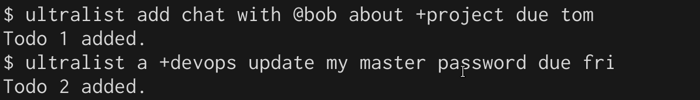
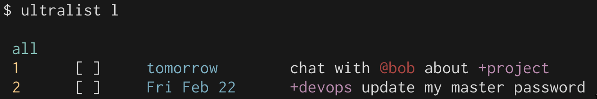
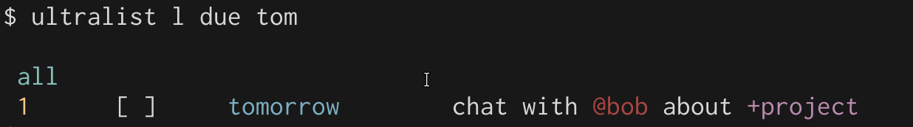
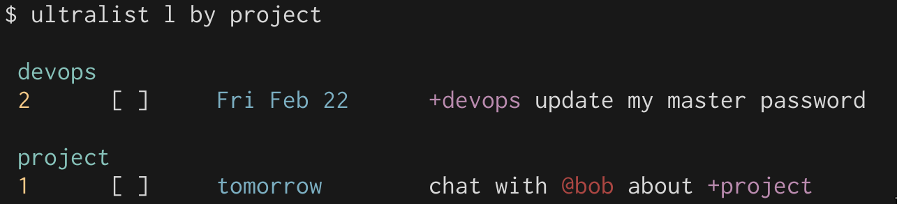
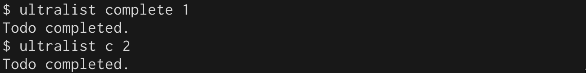
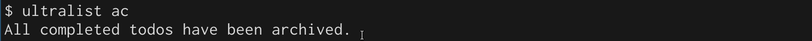

# Quick start

### 1. Initialize a new list

First, run `ultralist init` to intialize the .todos.json repo in the directory you are in.

### 2. Add a couple todos

You can add a todo by using the `add` or `a` directive:

### 3. List todos

This is the heart of the system. You can filter and group your todos. If the built-in filtering is not powerful enough for your tastes, you can always pipe the output to `grep`!

`ultralist list` takes many arguments.  You can filter by a due date:

You can also group by project or context:

### 4: Complete a todo

Completing a todo is done by using `ultralist complete` or `ultralist c`.

### 5: Archive completed todos

Finally, after all the work has been done, you can archive the todos so they are cleared off the list.

You can archive each one individually by running `ultralist ar [id]`, but since we have completed many todos today, we can run `todolist ac` instead, which will archive all completed todos.

And that's it!  You now know 90% of what you need to know in order to use `ultralist` effectively.

