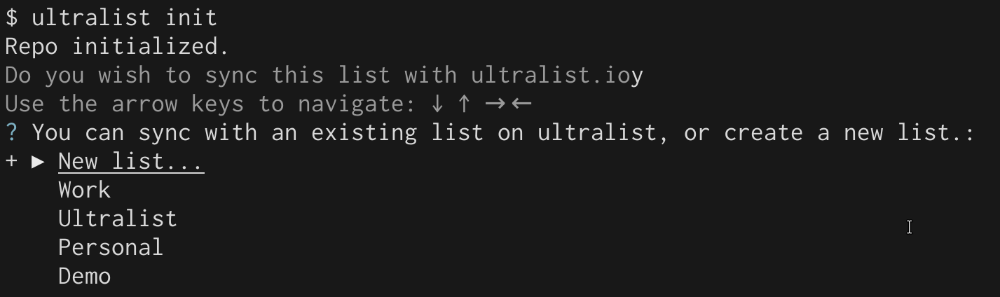

# Using Ultralist.io {#what}

[Ultralist.io](https://ultralist.io) is an enhancement service to the `ultralist` CLI.  With ultralist.io, you can:

* seamlessly sync your todolists to multiple computers
* have a slick web view of your todos
* gain access to `ultralist` native phone apps (coming soon).

**Note**: While the `ultralist` CLI will always be free and open source, ultralist.io is currently in a free public beta, and will become a paid service at some point.

## Creating an account and authenticating your `ultralist` cli {#creating_account}

There are 2 ways to create an account:

* Visit the [Ultralist.io signup page](https://app.ultralist.io/login)
* running `ultralist auth`.

Note that if you create an account directly on ultralist.io, you'll still need to run `ultralist auth` to register your CLI with Ultralist.io.

`ultralist` will create a directory - `~/.config/ultralist`. In that directory, it stores 2 files:

* `creds.json` - A token that `ultralist` will use to authenticate you
* `synced_lists.json` - This is how `ultralist` knows if a list is synced.

You can always run `ultralist check_auth` to ensure you're properly authenticated.

## Syncing a list {#sync}

There are a couple of ways to sync a list, depending if that list already exists or not.  

#### Creating a new list and setting it up to sync {#creating}

1. Ensure you're authenticated via `ultralist auth check`.
2. Create the list via `ultralist init`
3. Ultralist will ask if you want to sync this list with ultralist.io.  You can say `y`, and it will prompt you about which existing list you'd like to sync with, or to create a new list.  
4. Select `New list...` and give it a name.
5. Presto, this new list is set up to sync with ultralist.io.

#### Syncing a list that exists locally, but not on ultralist.io {#local_ultralist}

1. Ensure you're authenticated via `ultralist auth check`.
2. Run `ultralist sync`.  `ultralist` will prompt you for the list's name.
3. Presto, this list is now set up to sync with ultralist.io.

#### Syncing a list that exists on ultralist.io, but not locally {#ultralist_local}

1. Ensure you're authenticated via `ultralist auth check`.
2. In a directory that does not already have a `.todos.json` file, run `ultralist init`.  
3. `ultralist` will ask you if you want to sync this list with ultralist.io. Enter `y`.
4. Choose the existing list you'd like to sync with.
5. Presto, the list will automatically be downloaded locally and will be set up to sync.

#### Pulling changes to a list on ultralist.io locally

If you have a synced list and changes were made to it on ultralist.io, you can pull those changes by running `ultralist sync`.

## Opening the web view from `ultralist` {#web}

* `ultralist web` will open up the list on ultralist.io.

## How ultralist keeps lists in sync {#how}

`ultralist sync` has two roles for a synced list:
* It pushes local changes to ultralist.io.
* It pulls remote changes from ultralist.io.

For changes to your lists that you make locally, `ultralist` will automatically run `sync` in the background.  If you're online, these changes will update the ultralist.io list immediately.

If you make changes on ultralist.io, you'll need to pull those changes locally.  I have a cron task on my machine that will pull my synced lists every 15 minutes.

**Offline first**
* Syncing is designed to be offline-first and stays out of the way.  `ultralist` stores an event queue that it publishes to ultralist.io.  The ultralist.io backend uses a reconciliation algorithm that will always keep lists correctly in sync.
* The ultralist.io webapp uses the same event queue, and is also designed to run perfectly when offline.

# The ultralist.io app {#webapp}

